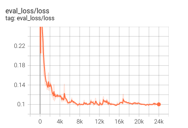
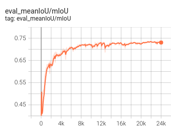

# DeepLabV3: Rethinking Atrous Convolution for Semantic Image Segmentation

<p align="center">
    <image src="images/deeplabv3.png">
</p>


## Environment
The dependencies are listed in `requirements.txt`. Please install and follow the command below:

```bash
pip install -r requirements.txt
```

## Data Preparation
You can download and use [PASCAL VOC 2012]() dataset for the training model. 

After that,
+ Put the data folder under the `dataset` directory
+ Setup config file for each dataset in `src/__init__.py`: replace `CFG_PATH` augment by `src/configs/pascalvoc.yml`

## Training
Before training, please modify configurations in `src/config/pascalvoc.yml`
```bash
python -m src.train
```

## Evaluation
```bash
python -m src.evaluate
```

**Result**

|Loss| Mean IoU|
|---|---|
| <p align='center'></p> | <p align='center'></p>  |


## Prediction
```bash
python -m src.predict
```


## Reference

+ [Rethinking Atrous Convolution for Semantic Image Segmentation](https://arxiv.org/abs/1706.05587)
+ [PaddleSegment]()

